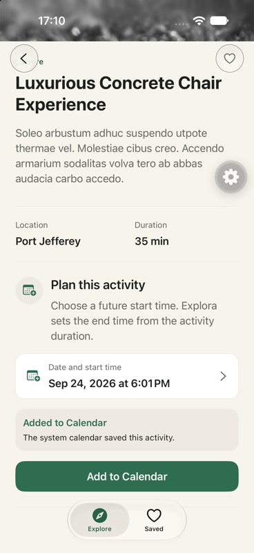
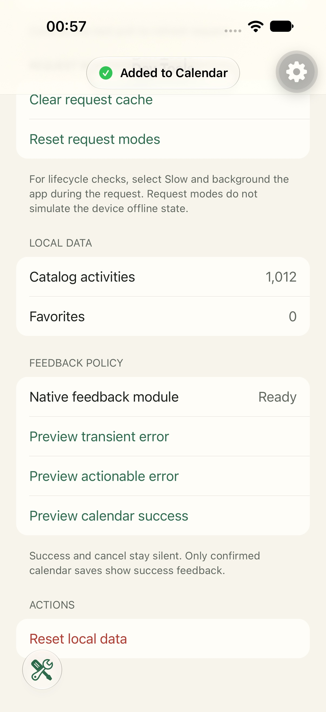
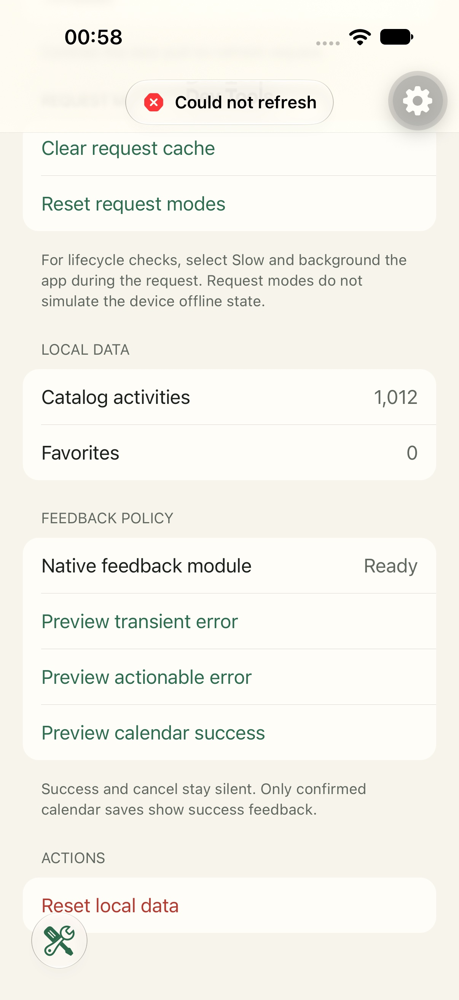

# Improvement: platform-native outcome feedback

## Summary

Explora replaced persistent React Native status banners with platform-native transient feedback.

The change solves a mobile feedback problem. Temporary outcomes must be visible without becoming permanent screen content.

This improvement is separate from the required calendar capability. The calendar uses the system calendar. This improvement changes feedback across several features.

## Problem

The baseline used in-flow React Native banners for calendar results and refresh failures.

The calendar success banner remained inside Activity Detail after the operation finished. It moved the activity actions and became permanent content.

A refresh failure also used an inline banner with a retry action. The catalog remained usable, so this recovery surface was too strong.

The baseline coordinated banners, haptic calls, and announcements across JavaScript hooks and components.

It did not package the outcome as one native surface with platform material, haptics, and accessibility behavior.

## Baseline evidence

The baseline is commit `4ace6e5` from 2026-09-24. It is the last commit before the native feedback module.

Use these commands to inspect the baseline implementation:

```bash
git show 4ace6e5:src/screens/activity-detail/add-to-calendar-section.tsx
git show 4ace6e5:src/screens/explore/use-explore-refresh.ts
```

The first file renders `CalendarStatusBanner` for a saved calendar result.

The second file stores refresh failures as an `ExploreBannerState`. It renders an inline recovery banner over usable catalog content.

The historical iOS screenshot shows the persistent calendar success banner:



## Native solution

Commit `7e83188` added the local `expo-native-toast` module and one universal TypeScript API.

### iOS

- SwiftUI adds a transparent overlay to the active app window.
- iOS 26 and later use Liquid Glass.
- Earlier systems use a native material fallback.
- Native notification haptics identify success, warning, and error outcomes.
- The module posts a native accessibility announcement.
- The toast disappears without changing the React Native layout.

### Android

- Kotlin presents a Material Snackbar above the bottom navigation.
- A semantic symbol identifies success, warning, error, or information.
- The module uses Android system haptic constants.
- The Snackbar keeps the native accessibility surface.
- The module queues feedback while a native dialog owns window focus.

## Feedback policy

The implementation also defines one feedback surface for each outcome.

| Outcome                                     | Before                              | After                       |
| ------------------------------------------- | ----------------------------------- | --------------------------- |
| Confirmed calendar save                     | Persistent in-flow success banner   | One native transient toast  |
| Refresh failure with usable catalog content | Inline banner with a retry action   | One native transient error  |
| Failure with a useful recovery action       | Inconsistent inline or toast result | One inline recovery surface |
| Routine success                             | No shared rule                      | No visible feedback         |
| Cancellation                                | Silent in the calendar path         | Silent across the policy    |

The app never shows a toast and an inline recovery surface for the same outcome.

## After evidence

The deterministic Dev Tools controls generated these images on an iPhone 18 Pro Simulator with iOS 27.0.





The Android evidence shows the platform-specific Material Snackbar:

- [Android success in light mode](./evidence/native-feedback/android-success-light.jpg)
- [Android error in light mode](./evidence/native-feedback/android-error-light.jpg)
- [Android success in dark mode](./evidence/native-feedback/android-success-dark.jpg)
- [Android feedback after a real calendar save](./evidence/native-calendar/android-saved-toast.jpg)

## Results

| Measure                                       | Before | After |
| --------------------------------------------- | ------ | ----- |
| Persistent rows after a calendar save         | 1      | 0     |
| Retry actions for a temporary refresh failure | 1      | 0     |
| Native platform feedback implementations      | 0      | 2     |
| Maximum surfaces allowed for one outcome      | Unset  | 1     |

The current iOS feedback flow passed in 35 seconds on 2026-09-27.

The final Android release feedback flow passed in 45.89 seconds on 2026-09-26.

The final iOS release app also passed calendar cancellation and save checks without Metro.

Use these files to reproduce or inspect the current behavior:

- Maestro flow: `.maestro/flows/feedback-surfaces.yaml`.
- Universal API: `src/native-toast/index.ts`.
- Swift implementation: `modules/expo-native-toast/ios/ExpoNativeToastModule.swift`.
- Kotlin implementation: `modules/expo-native-toast/android/src/main/java/expo/modules/nativetoast/`.
- Feedback policy tests: `src/feedback/feedback-policy.test.ts`.
- Android release result: `artifacts/maestro/android-final-eas-feedback.xml`.
- Release artifact proof: [`artifacts.md`](./artifacts.md).

## Limits

- The iOS screenshots use a development client because Dev Tools provides deterministic previews.
- The final iOS release app verified the real calendar outcome separately.
- The Android screenshots use an emulator.
- Simulator and emulator checks do not prove physical haptic strength.
- The before and after screenshots include unrelated interface changes from their source revisions.
- The comparison evaluates feedback behavior. It does not claim a conversion or retention effect.

## Related

- [Native feedback feature](../features/native-feedback.md)
- [Feedback policy decision](../decisions/adr-014-feedback-surface-policy.md)
- [Native calendar scenario](./scenarios.md#scenario-6-native-calendar)
